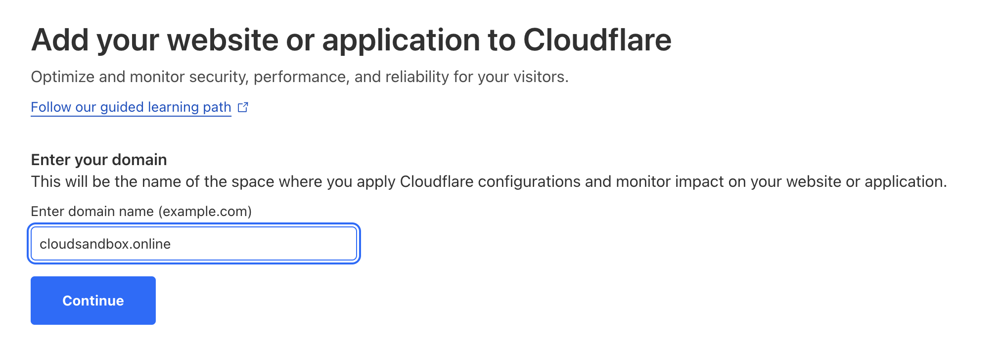
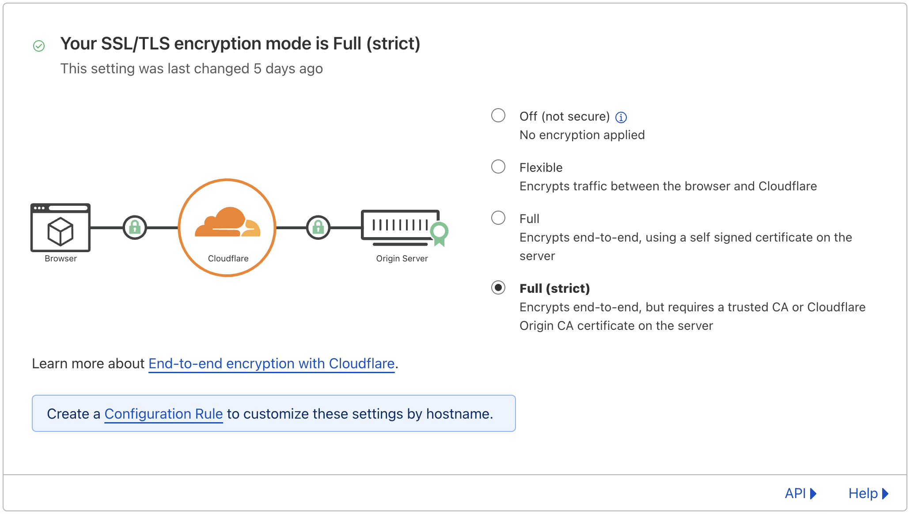
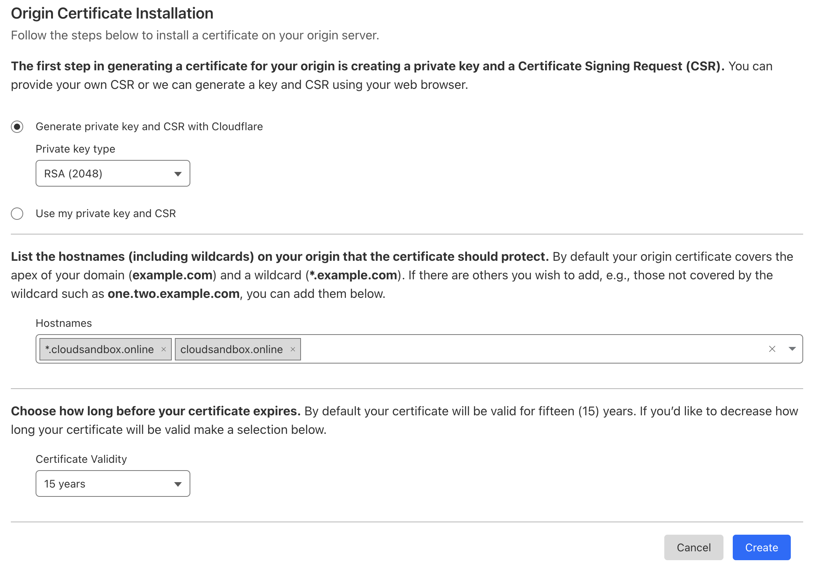

# Integrating DigitalOcean Kubernetes with Cloudflare for Enhanced Security

## Problem Statement
DigitalOcean offers a managed Kubernetes service (DOKS) with basic DDoS protection. When running an application in DOKS, users might require advanced DDoS protection, a Web Application Firewall (WAF), and other similar services that Cloudflare provides. This tutorial will describe how to integrate Cloudflare services with DOKS.

## Architecture
Let's imagine a web application running in DOKS. This application is a Kubernetes Deployment with a Service that publicly exposes it via DigitalOcean's managed load balancer. To access the application, a client connects via HTTPS to Cloudflare. Cloudflare inspects the request and gets it proxied to DigitalOcean over HTTPS. The load balancer on DigitalOcean receives the request, terminates TLS, and redirects it unencrypted over HTTP to one of the worker nodes. Terminating TLS on a load balancer is convenient for maintaining the TLS certificate at a single central point, thus avoiding the need to manage TLS certificates in a decentralized manner on worker nodes. The application then responds to the client through the same chain of proxies.


## Configuration Prerequisites
Ensure the following tools are configured on your computer:
- [doctl](https://docs.digitalocean.com/reference/doctl/how-to/install/)
- [kubectl](https://kubernetes.io/docs/tasks/tools/)
- [jq](https://stedolan.github.io/jq/download/)

## Configuration

### Adding a Site to Cloudflare
Have your domain name registered and ready. Use it to add a new site in Cloudflare. Cloudflare will manage the DNS records for this domain. For this guide, I will use the **free** Cloudflare plan and my domain `cloudsandbox.online` as an example.



You will be prompted to review your DNS records, but do not add anything just yet. Remember to update your authoritative DNS servers, or nameservers, at your domain registrar (such as GoDaddy or Namecheap) to point to Cloudflare.

### Enabling HTTPs End-to-End
In the Cloudflare control panel, navigate to your domain > SSL/TLS > Edge Certificates and enable "Always Use HTTPS". This ensures that traffic is always encrypted between the client and Cloudflare.


In the Cloudflare control panel, go to your domain > SSL/TLS > Overview and change the encryption mode to "Full (strict)". This ensures that traffic is encrypted not only between the client and Cloudflare but also between Cloudflare and DigitalOcean.



To encrypt traffic between Cloudflare and DigitalOcean, you will need to add a certificate to DigitalOcean's load balancer. This step will be covered later. For now, create and download this certificate from Cloudflare. Go to your domain > SSL/TLS > Origin Server and click "Create Certificate". Do not change the Key Format from PEM.




Copy the data from the "Origin Certificate" and save it as `origin_certificate.pem`. Copy the data from the "Private Key" and save it as `private_key.pem`. At this point, we have configured everything needed in Cloudflare. We can now proceed to DigitalOcean.

### Importing Origin Certificate to DigitalOcean
Now that you have two `.pem` files on your machine, you can import the origin certificate into DigitalOcean.

```bash
doctl compute certificate create --type custom --name cloudsandboxcert --leaf-certificate-path origin_certificate.pem --private-key-path private_key.pem
```

### Creating DOKS Cluster
Create a DOKS cluster on DigitalOcean. For example, I'm creating a cluster with two worker nodes in Frankfurt. Here's the `doctl` command:
```bash
doctl kubernetes cluster create cloudsandbox-cluster --count 2 --size s-1vcpu-2gb
```

To manage the cluster, you need to add an authentication token or certificate to your kubectl configuration file:
```bash
doctl kubernetes cluster kubeconfig save cloudsandbox-cluster
```

I'm running a sample application in Kubernetes with a Deployment of two Pods and a Service that exposes this application through a managed DigitalOcean load balancer on ports 80 and 443. Here's the manifest file.
```yaml
apiVersion: apps/v1
kind: Deployment
metadata:
  name: hello-world-deployment
spec:
  replicas: 2
  selector:
    matchLabels:
      app: hello-world
  template:
    metadata:
      labels:
        app: hello-world
    spec:
      containers:
      - image: ealen/echo-server:latest
        name: echoserver
        ports:
        - containerPort: 80
        env:
        - name: PORT
          value: "80"

---
apiVersion: v1
kind: Service
metadata:
  name: hello-world-service
  annotations:
    service.beta.kubernetes.io/do-loadbalancer-protocol: "https"
    service.beta.kubernetes.io/do-loadbalancer-tls-ports: "443"
    service.beta.kubernetes.io/do-loadbalancer-redirect-http-to-https: "true"
    service.beta.kubernetes.io/do-loadbalancer-certificate-id: "a7888ee6-98b9-415d-bc05-487zzz8b"
    service.beta.kubernetes.io/do-loadbalancer-disable-lets-encrypt-dns-records: "true"
    service.beta.kubernetes.io/do-loadbalancer-allow-rules: "cidr:103.21.244.0/22,cidr:173.245.48.0/20,cidr:103.21.244.0/22,cidr:103.22.200.0/22,cidr:103.31.4.0/22,cidr:141.101.64.0/18,cidr:108.162.192.0/18,cidr:190.93.240.0/20,cidr:188.114.96.0/20,cidr:197.234.240.0/22,cidr:198.41.128.0/17,cidr:162.158.0.0/15,cidr:104.16.0.0/13,cidr:104.24.0.0/14,cidr:172.64.0.0/13,cidr:131.0.72.0/22"
spec:
  type: LoadBalancer
  selector:
    app: hello-world
  ports:
    - name: http
      protocol: TCP
      port: 80
      targetPort: 80
    - name: https
      protocol: TCP
      port: 443
      targetPort: 80
```

We have imported the origin certificate from Cloudflare to DigitalOcean already. Every imported certificate is assigned an internal ID by DigitalOcean. To inform the load balancer which certificate to use, modify the manifest by adding the internal ID of your origin certificate to the `service.beta.kubernetes.io/do-loadbalancer-certificate-id` attribute. To find the available certificates and their respective IDs, use the `doctl` command:

```bash
doctl compute certificate list
```

The allow rules in `service.beta.kubernetes.io/do-loadbalancer-allow-rules` only list Cloudflare's IP ranges. This means that the load balancer will only accept traffic coming from Cloudflare. Clients won't be able to circumvent Cloudflare by directly connecting to a load balancer's IP address on DigitalOcean. An up-to-date list of Cloudflare's IPs is available on the [Cloudflare IP Ranges](https://www.cloudflare.com/ips/) page.

You can create this application in Kubernetes by applying the manifest file:
```bash
kubectl apply -f manifest.yaml
```

After about 5 minutes, check the Kubernetes Services:
```bash
kubectl get services -o wide
```

Note down the EXTERNAL-IP address. In Cloudflare, navigate back to your domain > DNS > Records and add an A-record pointing to this IP address.


This is all the required configuration. It's now time to verify the setup.

## Verification
We will use `curl` to verify our Kubernetes application, which runs an [echo server](https://github.com/Ealenn/Echo-Server). An echo server is a type of server that replicates the HTTPS request sent by the client and presents it back.

```bash
curl https://cloudsandbox.online | jq
```
Below is an example of the reply. I've only included the part with the headers that we are interested in.

```json
"headers": {
  "host": "cloudsandbox.online",
  "accept-encoding": "gzip",
  "x-forwarded-for": "32.185.143.12,172.71.103.51",
  "cf-ray": "835fdzzc4a665e-AMS",
  "x-forwarded-proto": "https",
  "cf-visitor": "{\"scheme\":\"https\"}",
  "user-agent": "curl/8.1.2",
  "accept": "*/*",
  "cf-connecting-ip": "32.185.143.12",
  "cdn-loop": "cloudflare",
  "cf-ipcountry": "NL",
  "x-forwarded-port": "443"
}
````

Note how Cloudflare utilizes the `x-forwarded-for` attribute to pass the client's IP address to your application on DigitalOcean. This allows the application to track connections. Such data can later be used for business intelligence and other purposes.

## Conclusion
This tutorial has guided you through setting up Cloudflare with a DOKS deployment to enhance the security of web applications.

We've secured traffic between the client and Cloudflare, as well as between Cloudflare and DigitalOcean. By implementing Cloudflare's IP ranges in DigitalOcean's load balancer, we limit access to the DOKS infrastructure, ensuring that traffic only passes through Cloudflare. This configuration mitigates the risk of direct attacks on the infrastructure. 

In summary, this integration leverages the strengths of both Cloudflare and DigitalOcean, providing a solution for businesses looking to protect their online presence.

## References
- DigitalOcean: [Adding Load Balancers](https://docs.digitalocean.com/products/kubernetes/how-to/add-load-balancers/)
- DigitalOcean: [Configuring Load Balancers](https://docs.digitalocean.com/products/kubernetes/how-to/configure-load-balancers/)
- DigitalOcean: [Managed Kubernetes Details](https://docs.digitalocean.com/products/kubernetes/details/managed/)
- Cloudflare: [SSL Concepts](https://developers.cloudflare.com/ssl/concepts/)
- Cloudflare: [How Cloudflare Works](https://developers.cloudflare.com/fundamentals/concepts/how-cloudflare-works/)
- Cloudflare: [HTTP Request Headers Reference](https://developers.cloudflare.com/fundamentals/reference/http-request-headers/)
- Cloudflare: [IP Ranges](https://www.cloudflare.com/ips/)
- GitHub: [Echo Server](https://github.com/Ealenn/Echo-Server)
